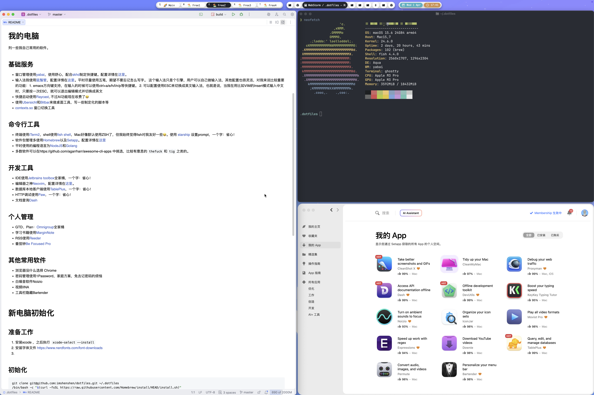

# 我的电脑
列一些我自己常用的软件。

## 基础服务
* 窗口管理使用[yabai](https://github.com/koekeishiya/yabai)，使用舒心，配合[skhd](https://github.com/koekeishiya/skhd)制定快捷键。配置详情在[这里](https://github.com/imshenshen/dotfiles/tree/master/yabai)。

* 输入法我使用[鼠鬚管](https://github.com/rime/squirrel)，配置详情在[这里](https://github.com/imshenshen/dotfiles/tree/master/rime)。平时尽量使用五笔，期望不要忘记怎么写字。
这个输入法只是个引擎，用户可以自己做输入法，其他配置也很灵活，对emacs方向键支持。

* 快捷启动使用[Alfred](https://www.alfredapp.com/)，功能优秀，可自定义Workflow。期待什么时候Mac的Spotlight能自带这么多功能就好了。

* 使用[Ubersicht](http://tracesof.net/uebersicht/)和[Bitbar](https://github.com/matryer/bitbar)来做桌面工具，写一些制定化的脚本等


## 命令行工具 
* 终端使用[iTerm2](https://www.iterm2.com/)，shell使用[fish shell](https://fishshell.com/)，Mac好像默认使用ZSH了，但我始终觉得fish对我友好一些😂。
* 软件包管理多使用[Homebrew](https://brew.sh/)以及[Setapp](https://setapp.com/)。配置详情在[这里](https://github.com/imshenshen/dotfiles/tree/master/homebrew)
* 平时使用的编程语言为[NodeJS](https://nodejs.org/en/)和[Golang](https://golang.org/)
* 多数软件可以在https://github.com/agarrharr/awesome-cli-apps中挑选，比较有意思的`thefuck`和`tig`之类的。

## 开发工具
* IDE使用[Jetbrains toolbox](https://www.jetbrains.com/toolbox-app/)全家桶，一个字：省心！
* 编辑器之神[Neovim](https://neovim.io/)，配置详情在[这里](https://github.com/imshenshen/dotfiles/tree/master/neovim)。
* 数据库本地客户端使用[TablePlus](https://tableplus.com/)，一个字：省心！
* HTTP调试使用[Paw](https://paw.cloud/)，一个字：省心！
* 文档查询[Dash](https://kapeli.com/dash)

## 个人管理
* GTD、Plan：[Omnigroup](https://www.omnigroup.com/)全家桶
* 学习书籍使用[MarginNote](https://www.marginnote.com/)
* RSS使用[Reeder](https://reederapp.com/)
* 番茄钟[Be Focused Pro](https://setapp.com/apps/be-focused)

## 其他常用软件
* 浏览器没什么选择 Chrome
* 密码管理使用1Password，家庭方案，免去记密码的烦恼
* 白噪音软件Noizio
* 日历Fantastical
* 视频IINA
* 工具栏隐藏Bartender
* MailSuite


# 新电脑初始化
## 初始化
```bash
git clone git@github.com:imshenshen/dotfiles.git ~/.dotfiles
Make
fisher add jethrokuan/z
```

## iterm2配置
1. 安装主题`${HOME}/.dotfiles/iterm2/OneHalfDark.itermcolors`和`${HOME}/.dotfiles/iterm2/OneHalfLight.itermcolors`
2. 执行`tic ${HOME}/.dotfiles/iterm2/xterm-256color.terminfo`
2. 执行`tic ${HOME}/.dotfiles/iterm2/xterm-256color-italic.terminfo`
3. iterm2 -> 设置 -> General -> preferences 设置配置文件路径为`${HOME}/.dotfiles/iterm2`

## fish配置
```bash
ln -s $HOME/.dotfiles/fish/* $XDH_CONFIG_HOME/fish/
```

## 安装输入法
1. 安装 https://rime.im ，https://github.com/rime/plum
2. 配置 -> 用户设定
```bash
curl -fsSL https://git.io/rime-install | bash
rime-install :preset wubi
ln -s $HOME/.dotfiles/rime/* $HOME/Library/Rime/
```
3. 设置 -> 重新部署

## 安装App Store中的软件，Setapp中的软件

## ubersicht
ubersicht配置Plugin的文件夹为`$HOME/.dotfiles/ubersicht`

## Bitbar
