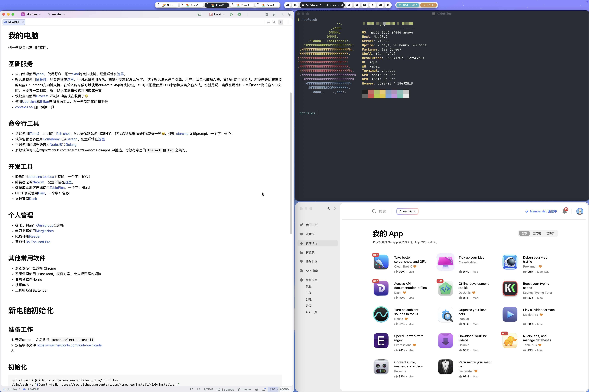

# 我的电脑
列一些我自己常用的软件。

## 基础服务
* 窗口管理使用[yabai](https://github.com/koekeishiya/yabai)，使用舒心，配合[skhd](https://github.com/koekeishiya/skhd)制定快捷键。配置详情在[这里](https://github.com/imshenshen/dotfiles/tree/master/yabai)。

* 输入法我使用[鼠鬚管](https://github.com/rime/squirrel)，配置详情在[这里](https://github.com/imshenshen/dotfiles/tree/master/rime)。平时尽量使用五笔，期望不要忘记怎么写字。
这个输入法只是个引擎，用户可以自己做输入法，其他配置也很灵活，对我来说比较重要的功能：1. emacs方向键支持，在输入的时候可以使用ctrl+a/e/h/l/n/p等快捷键。 2. 可以配置使用ESC来切换成英文输入法，也就是说，当我在用比如VIM的Insert模式输入中文时，只要按一次ESC，就可以退出编辑模式并切换成英文

* 快捷启动使用[Raycast](https://www.raycast.com/), 不过AI功能现在收费了😂️

* 使用[Ubersicht](http://tracesof.net/uebersicht/)和[Bitbar](https://github.com/matryer/bitbar)来做桌面工具，写一些制定化的脚本等

* [contexts.so](contexts.so) 窗口切换工具

## 命令行工具 
* 终端使用[iTerm2](https://www.iterm2.com/)，shell使用[fish shell](https://fishshell.com/)，Mac好像默认使用ZSH了，但我始终觉得fish对我友好一些😂。使用 [starship](https://starship.rs/) 设置prompt，一个字：省心！
* 软件包管理多使用[Homebrew](https://brew.sh/)以及[Setapp](https://setapp.com/)。配置详情在[这里](https://github.com/imshenshen/dotfiles/tree/master/homebrew)
* 平时使用的编程语言为[NodeJS](https://nodejs.org/en/)和[Golang](https://golang.org/)
* 多数软件可以在https://github.com/agarrharr/awesome-cli-apps 中挑选，比较有意思的`thefuck`和`tig`之类的。

## 开发工具
* IDE使用[Jetbrains toolbox](https://www.jetbrains.com/toolbox-app/)全家桶，一个字：省心！
* 编辑器之神[Neovim](https://neovim.io/)，配置详情在[这里](https://github.com/imshenshen/dotfiles/tree/master/neovim)。
* 数据库本地客户端使用[TablePlus](https://tableplus.com/)，一个字：省心！
* HTTP调试使用[Paw](https://paw.cloud/)，一个字：省心！
* 文档查询[Dash](https://kapeli.com/dash)

## 个人管理
* GTD、Plan：[Omnigroup](https://www.omnigroup.com/)全家桶
* 学习书籍使用[MarginNote](https://www.marginnote.com/)
* RSS使用[Reeder](https://reederapp.com/)
* 番茄钟[Be Focused Pro](https://setapp.com/apps/be-focused)

## 其他常用软件
* 浏览器没什么选择 Chrome
* 密码管理使用1Password，家庭方案，免去记密码的烦恼
* 白噪音软件Noizio
* 视频IINA
* 工具栏隐藏Bartender


# 新电脑初始化

## 准备工作
1. 安装xcode ，之后执行 `xcode-select --install`
2. 安装字体文件 https://www.nerdfonts.com/font-downloads
3. 

## 初始化
```bash
git clone git@github.com:imshenshen/dotfiles.git ~/.dotfiles
/bin/bash -c "$(curl -fsSL https://raw.githubusercontent.com/Homebrew/install/HEAD/install.sh)"
Make
# edit ~/.gitconfig turn proxy config
```
## 电脑配置
1. 系统偏好设置
   2. 桌面与程序坞
      3. 调度中心：关闭重排空间
   4. 键盘
      6. 快捷键：关闭各种快捷键

## iterm2配置
1. 安装主题`${HOME}/.dotfiles/iterm2/OneHalfDark.itermcolors`和`${HOME}/.dotfiles/iterm2/OneHalfLight.itermcolors`
2. 执行`tic ${HOME}/.dotfiles/iterm2/xterm-256color.terminfo`
2. 执行`tic ${HOME}/.dotfiles/iterm2/xterm-256color-italic.terminfo`
3. iterm2 -> 设置 -> General -> preferences 设置配置文件路径为`${HOME}/.dotfiles/iterm2`
4. iterm2支持TouchID： https://apple.stackexchange.com/questions/259093/can-touch-id-for-the-mac-touch-bar-authenticate-sudo-users-and-admin-privileges
5. 安装 AI Plugin https://iterm2.com/ai-plugin.html

## fish配置
```bash
ln -s $HOME/.dotfiles/fish/* $XDG_CONFIG_HOME/fish/
```

## 安装输入法
1. 安装 https://rime.im ，https://github.com/rime/plum
2. 配置 -> 用户设定
```bash
curl -fsSL https://raw.githubusercontent.com/rime/plum/master/rime-install | bash -s -- prelude wubi pinyin-simp luna-pinyin gaboolic/rime-frost:others/recipes/full
ln -sf $HOME/.dotfiles/rime/* $HOME/Library/Rime/
```
3. 设置 -> 重新部署
4. 删除 Mac 默认 ABC 输入法：
5. 
    ```bash
    # 1. 删除多余的输入法，只保留默认的英文输入法和正在使用的输入法
    # 2. 
    sudo vim ~/Library/Preferences/com.apple.HIToolbox.plist # 在AppleEnabledInputSources 中删除 ABC
    # 3. 重启电脑
    ```
## Chrome
### 添加 TabToWindows 扩展
* 管理扩展程序 -> 启用开发者模式 -> 加载已解压的扩展程序 -> 选择TabToWindows文件夹
* 管理扩展程序 -> 键盘快捷键 -> TabToWindows -> 激活快捷键 -> 设置为 `⇧⌘O` 

## Raycast
1. 在 raycase/myExtensions/yabai中，执行下npm run dev，就可以在raycast中使用yabai的命令了

## 安装App Store中的软件，Setapp中的软件

## ubersicht
ubersicht配置Plugin的文件夹为`$HOME/.dotfiles/ubersicht`

## Bitbar
